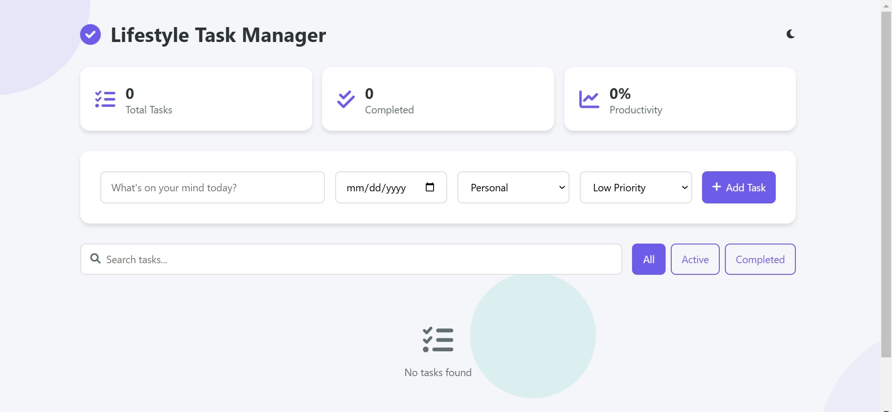

# TaskFlow Pro - Advanced Task Management System

## 🌟 Overview

TaskFlow Pro is a modern, feature-rich task management application built with vanilla JavaScript, utilizing advanced CSS animations and a responsive design. This project demonstrates proficiency in front-end development while providing a practical and visually appealing solution for task management.

### 🎯 Key Features

- **Intuitive Task Management**
  - Create, edit, and delete tasks
  - Set priority levels and categories
  - Add due dates for better organization
  - Mark tasks as complete/incomplete

- **Smart Filtering & Search**
  - Real-time search functionality
  - Filter tasks by status (All/Active/Completed)
  - Category-based filtering
  - Priority-based organization

- **Visual Statistics**
  - Track total tasks
  - Monitor completed tasks
  - View productivity percentage
  - Visual progress indicators

- **Modern UI/UX**
  - Smooth animations and transitions
  - Responsive design for all devices
  - Dark/Light theme support
  - Interactive notifications

- **Data Management**
  - Local storage persistence
  - Export tasks to JSON
  - Bulk actions (clear completed)
  - Data backup and restore

## 🛠️ Technologies Used

- HTML5
- CSS3 (Advanced Animations & Flexbox)
- JavaScript (ES6+)
- Local Storage API
- Font Awesome Icons

## 🤝 Contributing

1. Fork the repository
2. Create your feature branch (`git checkout -b feature/AmazingFeature`)
3. Commit your changes (`git commit -m 'Add some AmazingFeature'`)
4. Push to the branch (`git push origin feature/AmazingFeature`)
5. Open a Pull Request

## 📝 Future Enhancements

- [ ] Add drag-and-drop task reordering
- [ ] Implement subtasks and task dependencies
- [ ] Add data synchronization across devices
- [ ] Integrate with calendar applications
- [ ] Add task sharing capabilities
- [ ] Implement task analytics and reporting
- [ ] Add voice input for task creation

## 📈 Project Status

Project is: _in progress_

Last Updated: November 2024

---

If you found this project helpful, please give it a ⭐️!
